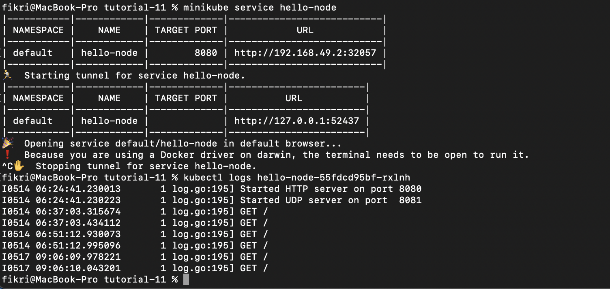
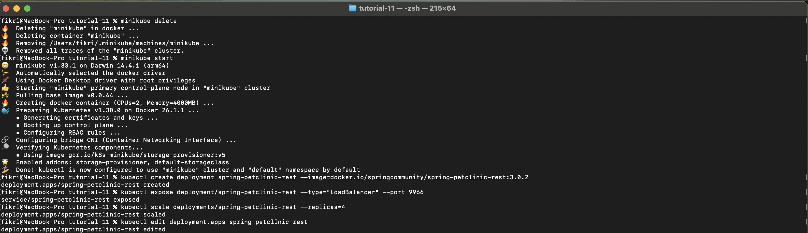
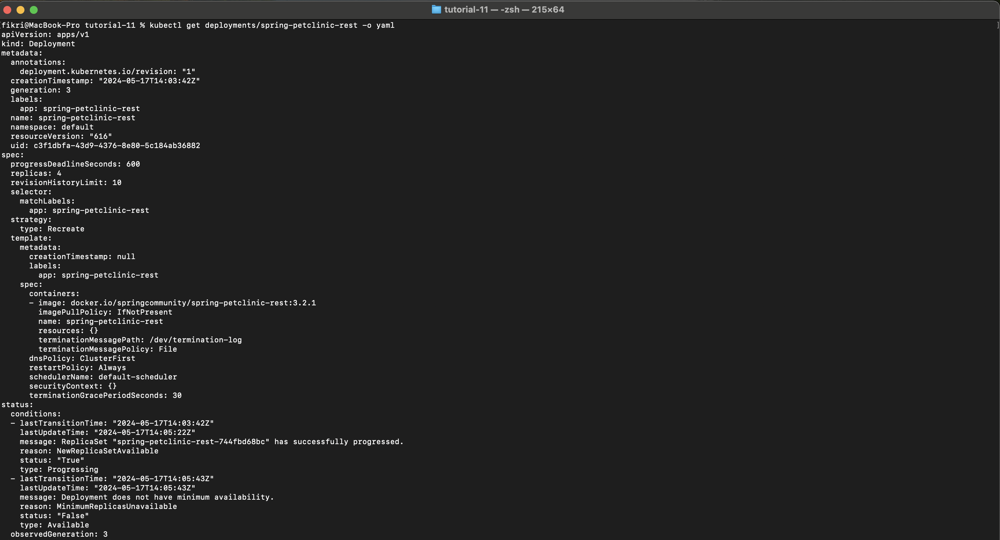
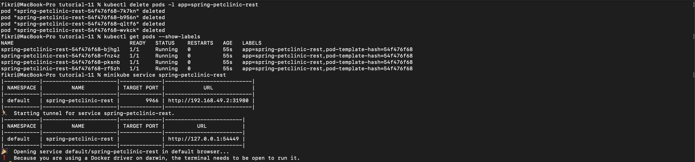

# Tutorial 11
Fikri Risyad Indratno</br>
2206031170</br>
Advanced Programming B</br>

---

## Reflection 1

> Compare the application logs before and after you exposed it as a Service. Try to open the app several times while the proxy into the Service is running. What do you see in the logs? Does the number of logs increase each time you open the app?



Yes, the number of logs increases each time I open the app. After I exposed it, the service can receive requests and each request will be recorded and shown in the logs.

> Notice that there are two versions of `kubectl get` invocation during this tutorial section. The first does not have any option, while the latter has `-n` option with value set to `kube-system`. What is the purpose of the `-n` option and why did the output not list the pods/services that you explicitly created?

The purpose of `-n` is to show services in the `kube-system` namespace. Without `-n`, it shows services in the default namespace. The output did not list the pods/services that I explicitly created because I created them in the default namespace.

## Reflection 2

> What is the difference between Rolling Update and Recreate deployment strategy?

In Recreate Deployment Strategy, all existing pods are killed before the new ones are created with the updated version, thus involving downtime in the update process. In Rolling Update Deployment, the pods are incrementally updated by replacing the current pods with the new ones with the updated version, allowing it to be updated without downtime.

> Try deploying the Spring Petclinic REST using Recreate deployment strategy and document your attempt.





> Prepare different manifest files for executing Recreate deployment strategy.

```
apiVersion: apps/v1
kind: Deployment
metadata:
  annotations:
    deployment.kubernetes.io/revision: "2"
  creationTimestamp: "2024-05-17T14:03:42Z"
  generation: 3
  labels:
    app: spring-petclinic-rest
  name: spring-petclinic-rest
  namespace: default
  resourceVersion: "893"
  uid: c3f1dbfa-43d9-4376-8e80-5c184ab36882
spec:
  progressDeadlineSeconds: 600
  replicas: 4
  revisionHistoryLimit: 10
  selector:
    matchLabels:
      app: spring-petclinic-rest
  strategy:
    type: Recreate
  template:
    metadata:
      creationTimestamp: null
      labels:
        app: spring-petclinic-rest
    spec:
      containers:
      - image: docker.io/springcommunity/spring-petclinic-rest:3.2.1
        imagePullPolicy: IfNotPresent
        name: spring-petclinic-rest
        resources: {}
        terminationMessagePath: /dev/termination-log
        terminationMessagePolicy: File
      dnsPolicy: ClusterFirst
      restartPolicy: Always
      schedulerName: default-scheduler
      securityContext: {}
      terminationGracePeriodSeconds: 30
status:
  availableReplicas: 4
  conditions:
  - lastTransitionTime: "2024-05-17T14:03:42Z"
    lastUpdateTime: "2024-05-17T14:07:06Z"
    message: ReplicaSet "spring-petclinic-rest-54f476f68" has successfully progressed.
    reason: NewReplicaSetAvailable
    status: "True"
    type: Progressing
  - lastTransitionTime: "2024-05-17T14:08:07Z"
    lastUpdateTime: "2024-05-17T14:08:07Z"
    message: Deployment has minimum availability.
    reason: MinimumReplicasAvailable
    status: "True"
    type: Available
  observedGeneration: 3
  readyReplicas: 4
  replicas: 4
  updatedReplicas: 4
```

> What do you think are the benefits of using Kubernetes manifest files? Recall your experience in deploying the app manually and compare it to your experience when deploying the same app by applying the manifest files (i.e., invoking `kubectl apply -f` command) to the cluster.

I think it is easier and faster making it more efficient than manually deploying the app. I don't have to remember the steps from the tutorial. I only need to prepare the manifest files and do `kubectl apply -f`. It minimizes mistakes that can happen when we do the steps one by one.